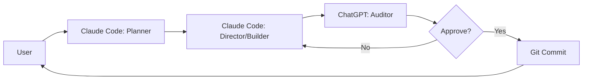
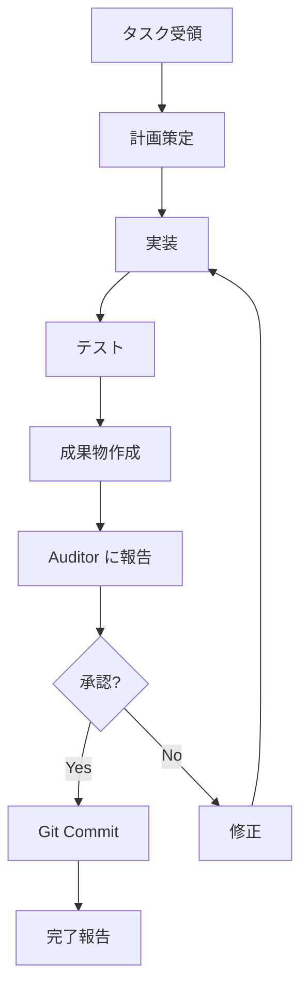
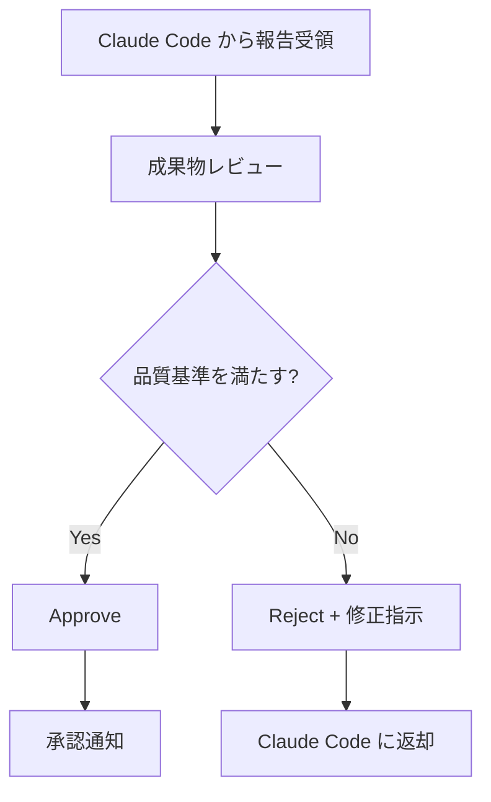
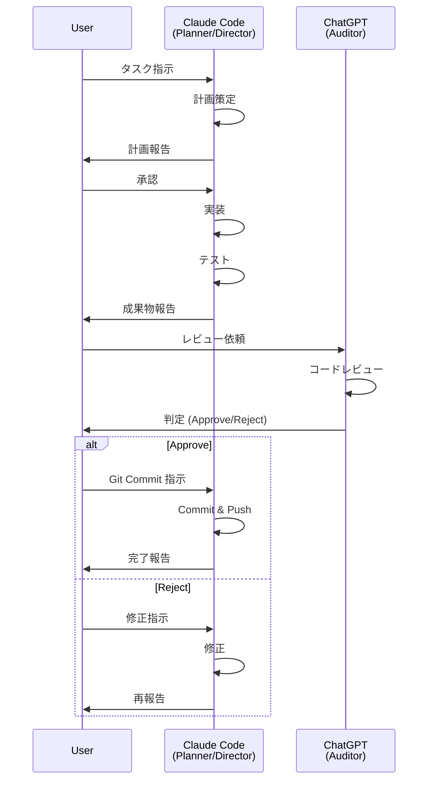

# 🤖 AI Squad 環境構築ガイド
**Planner/Director (Claude Code) + Auditor (ChatGPT) 連携体制**

---

## 📋 目次
1. [環境構築の概要](#環境構築の概要)
2. [VS Code 環境構築](#vs-code-環境構築)
3. [Claude Code (Planner/Director) のセットアップ](#claude-code-plannerdirector-のセットアップ)
4. [ChatGPT (Auditor) のセットアップ](#chatgpt-auditor-のセットアップ)
5. [ワークフロー](#ワークフロー)
6. [命令文テンプレート](#命令文テンプレート)

---

## 1. 環境構築の概要

### AI Squad の役割分担



| 役割 | AI | 責任 |
| :--- | :--- | :--- |
| **Planner** | Claude Code (VS Code) | タスク分解、設計、計画策定 |
| **Director/Builder** | Claude Code (VS Code) | コーディング、テスト、Git操作 |
| **Auditor** | ChatGPT (Web/Desktop) | コードレビュー、品質保証、承認/却下 |

> [!IMPORTANT]
> **Auditor 連携: 手動 or 自動**
> 
> **手動連携（デフォルト）:**
> - あなた（ユーザー）が Claude Code と ChatGPT の橋渡し役
> - `scripts/auditor-helper.js` で半自動化可能
> 
> **自動連携（推奨）:**
> - GitHub Actions + ChatGPT API で完全自動化
> - セットアップ方法: `docs/AUDITOR_AUTOMATION_SETUP.md` を参照
> - PR/Issue コメントに `@auditor review` でトリガー

---

## 2. VS Code 環境構築

### 2.1 必要な拡張機能

#### **必須:**
1. **Claude Code** (Anthropic)
   - VS Code Marketplace からインストール
   - API キーを設定

2. **Git Graph** (推奨)
   - Git の視覚化に便利

3. **TypeScript and JavaScript Language Features** (標準搭載)
   - VS Code に標準で組み込まれています (インストール不要)
   - `@builtin` で検索して有効化されているか確認可能

#### **推奨:**
4. **ESLint**
5. **Prettier - Code formatter**
6. **Material Icon Theme**

### 2.2 VS Code 設定

**settings.json に追加:**
```json
{
  "terminal.integrated.defaultProfile.windows": "PowerShell",
  "git.enableSmartCommit": true,
  "git.confirmSync": false,
  "editor.formatOnSave": true,
  "typescript.updateImportsOnFileMove.enabled": "always"
}
```

### 2.3 ワークスペース設定

**V10 ディレクトリを開く:**
```
File → Open Folder → C:\Users\satos\OneDrive\○大西\〇新CRMプロジェクト\Githubとの連携リポジトリ宛先\V10
```

---

## 3. Claude Code (Planner/Director) のセットアップ

### 3.1 Claude Code の起動

1. VS Code で `Ctrl+Shift+P` (コマンドパレット)
2. "Claude: Open Chat" を選択
3. チャットウィンドウが開く

### 3.2 初回セットアップ

**Claude Code に以下のシステムプロンプトを設定:**

> **注意:** Claude Code は現在システムプロンプトのカスタマイズをサポートしていない可能性があります。
> その場合は、毎回の会話開始時に役割を明示してください。

**会話開始時のプロンプト (テンプレート):**
```markdown
# あなたの役割

あなたは **CRM V10 プロジェクトの Planner 兼 Director** です。
以下の役割を担当します:

## Planner としての役割
- ユーザーの要望を技術タスクに分解
- 実装計画の策定
- アーキテクチャ設計

## Director としての役割
- コーディング、テスト、リファクタリング
- Git 操作 (Worktree, Commit, Push)
- ビルド、デプロイ
- 自律的な問題解決 (Self-Healing)

## 重要な制約

1. **Autonomous Execution Protocol を厳守**
   - 標準的なコマンドはユーザー確認なしで実行
   - 破壊的操作のみ確認を求める

2. **Git Worktree Isolation Protocol を厳守**
   - `git checkout` は禁止
   - 必ず `git worktree add` を使用

3. **Documentation Protocol を厳守**
   - コミット前に必ず `CURRENT_STATUS.md` を更新

4. **Auditor への報告義務**
   - タスク完了時は必ず成果物を報告
   - Auditor の承認を得てから Git Commit

## 必読ドキュメント

作業開始前に以下を読み込んでください:
1. `HANDOVER_DOCUMENT.md` (最重要)
2. `PROJECT_MANIFEST.md` (開発ルール)
3. `CURRENT_STATUS.md` (現在の状態)

---

準備ができたら「準備完了。タスクを開始します。」と報告してください。
```

### 3.3 作業フロー (Claude Code)



---

## 4. ChatGPT (Auditor) のセットアップ

### 4.1 ChatGPT の準備

**推奨環境:**
- ChatGPT Web (https://chat.openai.com/)
- または ChatGPT Desktop App

**推奨モデル:**
- GPT-4 (最新版)

### 4.2 Auditor 用カスタム指示 (Custom Instructions)

**ChatGPT の設定 → Custom Instructions に以下を設定:**

#### **What would you like ChatGPT to know about you to provide better responses?**
```
I am working on the CRM V10 project as an Auditor.
My role is to review code, ensure quality, and approve/reject changes.
I work with Claude Code (Planner/Director) who implements the code.
I must be strict and ensure all code follows the project's rules.
```

#### **How would you like ChatGPT to respond?**
```
- Act as a strict code auditor
- Review code for security, quality, and compliance
- Provide clear Approve/Reject decisions
- When rejecting, provide specific reasons and improvement suggestions
- Reference PROJECT_MANIFEST.md and HANDOVER_DOCUMENT.md for standards
- Be concise but thorough
- Use Japanese for communication
```

### 4.3 Auditor の作業フロー



---

## 5. ワークフロー

### 5.1 標準的な開発サイクル

#### **Step 1: タスク開始 (User → Claude Code)**

**ユーザーが Claude Code に指示:**
```markdown
Phase 3: Frontend Setup を開始してください。

タスク:
1. Material UI の再導入
2. React Router の再導入
3. ビルド検証
4. デプロイ

詳細は PHASE3_STARTUP_INSTRUCTIONS.md を参照してください。
```

#### **Step 2: 計画策定 (Claude Code: Planner)**

**Claude Code が実施:**
1. ドキュメント読み込み
2. 実装計画策定
3. タスク分解

**Claude Code がユーザーに報告:**
```markdown
Phase 3 の実装計画を策定しました。

## 実装計画
1. Git Worktree 作成
2. Material UI インストール
3. React Router インストール
4. ビルド検証
5. デプロイ

作業を開始してよろしいですか?
```

#### **Step 3: 実装 (Claude Code: Director)**

**Claude Code が実施:**
1. Git Worktree 作成
2. 依存関係インストール
3. コーディング
4. ビルド
5. デプロイ
6. 動作確認

#### **Step 4: 成果物作成 (Claude Code)**

**Claude Code が作成:**
1. 変更内容のサマリー
2. 変更ファイル一覧
3. テスト結果
4. スクリーンショット (可能であれば)

**成果物フォーマット (例):**
```markdown
# Phase 3: Frontend Setup 完了報告

## 実施内容
- Material UI インストール完了
- React Router インストール完了
- ビルド成功 (エラーなし)
- デプロイ成功 (Web App URL: https://...)

## 変更ファイル
- frontend/package.json (依存関係追加)
- frontend/src/App.tsx (Material UI 適用)
- CURRENT_STATUS.md (Changelog 更新)

## テスト結果
- Frontend ビルド: ✅ 成功
- 統合ビルド: ✅ 成功
- デプロイ: ✅ 成功
- 動作確認: ✅ 正常表示

## 次のアクション
Auditor のレビューをお願いします。
```

#### **Step 5: Auditor レビュー (User → ChatGPT)**

**ユーザーが ChatGPT に報告内容を転送:**

**ChatGPT へのプロンプト (テンプレート):**
```markdown
# Auditor レビュー依頼

あなたは CRM V10 プロジェクトの Auditor です。
Claude Code (Planner/Director) が Phase 3 を完了しました。
以下の成果物をレビューし、Approve/Reject を判定してください。

## 成果物

[Claude Code の報告内容をここに貼り付け]

## レビュー基準

1. PROJECT_MANIFEST.md のルールに準拠しているか
2. CURRENT_STATUS.md が更新されているか
3. ビルドエラーがないか
4. デプロイが成功しているか
5. セキュリティ上の問題がないか

## 判定

以下の形式で回答してください:

**判定:** [Approve / Reject]

**理由:**
- [理由1]
- [理由2]

**改善提案 (Reject の場合):**
- [提案1]
- [提案2]
```

#### **Step 6: 判定結果の伝達 (ChatGPT → User → Claude Code)**

**ChatGPT が判定:**
```markdown
**判定:** Approve

**理由:**
- Material UI と React Router が正しくインストールされている
- ビルドエラーがない
- CURRENT_STATUS.md が更新されている
- デプロイが成功している

**次のアクション:**
Git Commit & Push を実行してください。
```

**ユーザーが Claude Code に伝達:**
```markdown
Auditor のレビュー結果: Approve

Git Commit & Push を実行してください。
```

#### **Step 7: Git Commit (Claude Code)**

**Claude Code が実施:**
```bash
git add .
git commit -m "feat: Phase 3 - Material UI & React Router integration"
git push origin feat/phase3-frontend
```

---

## 6. 命令文テンプレート

### 6.1 Claude Code (Planner/Director) への初回指示

**ファイル:** `INITIAL_PROMPT_FOR_CLAUDE_CODE.txt`

```markdown
# CRM V10 プロジェクト開始

あなたは **CRM V10 プロジェクトの Planner 兼 Director** です。

## あなたの役割

### Planner としての役割
- ユーザーの要望を技術タスクに分解
- 実装計画の策定
- アーキテクチャ設計

### Director としての役割
- コーディング、テスト、リファクタリング
- Git 操作 (Worktree, Commit, Push)
- ビルド、デプロイ
- 自律的な問題解決

## 重要な制約

1. **Autonomous Execution Protocol**
   - 標準的なコマンドはユーザー確認なしで実行
   - 破壊的操作のみ確認を求める

2. **Git Worktree Isolation Protocol**
   - `git checkout` は禁止
   - 必ず `git worktree add` を使用

3. **Auditor への報告義務**
   - タスク完了時は必ず成果物を報告
   - Auditor の承認を得てから Git Commit

## 必読ドキュメント

以下を読み込んでください:
1. `HANDOVER_DOCUMENT.md`
2. `PROJECT_MANIFEST.md`
3. `CURRENT_STATUS.md`

## 最初のタスク

Phase 3: Frontend Setup を開始してください。
詳細は `PHASE3_STARTUP_INSTRUCTIONS.md` を参照してください。

---

準備ができたら「準備完了。タスクを開始します。」と報告してください。
```

### 6.2 ChatGPT (Auditor) への標準レビュー依頼

**テンプレート:** `AUDITOR_REVIEW_TEMPLATE.md`

```markdown
# Auditor レビュー依頼

あなたは **CRM V10 プロジェクトの Auditor (Strict Judge)** です。
Claude Code (Planner/Director) がタスクを完了しました。
以下の成果物をレビューし、**Approve/Reject** を判定してください。

## 成果物

### タスク名
[タスク名を記入]

### 実施内容
[実施内容を記入]

### 変更ファイル
[変更ファイル一覧を記入]

### テスト結果
[テスト結果を記入]

## レビュー基準

以下の基準で評価してください:

1. **ルール準拠**
   - `PROJECT_MANIFEST.md` のルールに準拠しているか
   - Git Worktree Isolation Protocol を守っているか

2. **品質**
   - ビルドエラーがないか
   - TypeScript の型エラーがないか
   - セキュリティ上の問題がないか

3. **ドキュメント**
   - `CURRENT_STATUS.md` が更新されているか
   - Changelog に変更内容が記載されているか

4. **動作確認**
   - デプロイが成功しているか
   - 動作確認が実施されているか

## 判定フォーマット

以下の形式で回答してください:

---

**判定:** [✅ Approve / ❌ Reject]

**評価:**
- ルール準拠: [✅/❌]
- 品質: [✅/❌]
- ドキュメント: [✅/❌]
- 動作確認: [✅/❌]

**理由:**
- [理由1]
- [理由2]

**改善提案 (Reject の場合のみ):**
- [提案1]
- [提案2]

**次のアクション:**
[Approve の場合: Git Commit & Push を実行]
[Reject の場合: 修正後に再提出]

---
```

### 6.3 Reject 時の Claude Code への指示

**テンプレート:**
```markdown
Auditor のレビュー結果: Reject

## 指摘事項

[ChatGPT の指摘内容を貼り付け]

## 修正指示

上記の指摘事項に従って修正してください。
修正完了後、再度 Auditor にレビューを依頼します。
```

---

## 7. RPA 検証とスクリーンショット

### 7.1 Playwright による自動検証

**VS Code の Claude Code には RPA 機能がないため、Playwright スクリプトを使用します。**

#### セットアップ

1. **Playwright のインストール**
   ```powershell
   npm install -D playwright
   npx playwright install chromium
   ```

2. **検証スクリプトの確認**
   - `scripts/verify-deployment.js` が存在することを確認

#### 使用方法

**デプロイ後の検証:**
```powershell
# 環境変数に Web App URL を設定
$env:DEPLOYMENT_URL="https://script.google.com/macros/s/YOUR_DEPLOYMENT_ID/exec"

# 検証スクリプト実行
node scripts/verify-deployment.js
```

**検証内容:**
- ✅ ページの読み込み確認
- ✅ React アプリケーションの起動確認
- ✅ Material UI コンポーネントの検出
- ✅ コンソールエラーのチェック
- 📸 各ステップのスクリーンショット保存 (`screenshots/` ディレクトリ)

#### Claude Code への指示例

```markdown
デプロイが完了したら、以下のコマンドで検証を実行してください:

1. Web App URL を取得: `clasp deployments`
2. 環境変数に設定: `$env:DEPLOYMENT_URL="[取得したURL]"`
3. 検証実行: `node scripts/verify-deployment.js`
4. スクリーンショットを確認: `screenshots/` ディレクトリ
5. 検証結果を報告してください
```

### 7.2 手動スクリーンショット取得

**Playwright が使えない場合:**

1. **ブラウザで Web App URL を開く**
2. **開発者ツールを開く** (`F12`)
3. **コンソールエラーを確認**
4. **手動でスクリーンショットを保存**
5. **Claude Code に結果を報告**

---

## 8. トラブルシューティング

### 8.1 Claude Code が自律実行しない場合

**問題:** Claude Code がコマンド実行の許可を求めてくる

**解決策:**
1. 会話の冒頭で Autonomous Execution Protocol を明示
2. "ユーザー確認なしで実行してください" と明示的に指示

### 8.2 ChatGPT が詳細すぎるレビューをする場合

**問題:** レビューが長すぎて要点が不明確

**解決策:**
1. Custom Instructions に "Be concise" を追加
2. レビュー依頼時に "簡潔に判定してください" と明示

### 8.3 Claude Code と ChatGPT の情報共有が煩雑

**問題:** 手動でコピー&ペーストが面倒

**解決策 (将来):**
1. GitHub Issues/PR を活用
2. Markdown ファイルで成果物を共有
3. 自動化スクリプトの作成

---

### 8.4 Playwright 検証が失敗する場合

**問題:** `node scripts/verify-deployment.js` がエラーになる

**解決策:**
1. Playwright がインストールされているか確認: `npm list playwright`
2. Chromium がインストールされているか確認: `npx playwright install chromium`
3. `DEPLOYMENT_URL` が正しく設定されているか確認
4. 手動でブラウザを開いて動作確認

### 8.5 Auditor との連携を効率化したい

**問題:** 手動でコピー&ペーストが煩雑

**解決策:**
1. **ヘルパースクリプトを使用:**
   ```powershell
   # レビュー依頼ファイルを生成
   node scripts/auditor-helper.js request "Phase 3" "Material UI インストール完了" "package.json,App.tsx" "ビルド成功"
   
   # 生成されたファイルを開いて ChatGPT にコピー
   code auditor_reviews/review_request_*.md
   ```

2. **GitHub Issues/PR を活用（将来）:**
   - Claude Code が成果物を Issue に投稿
   - ChatGPT API が自動レビュー
   - 結果を PR コメントに返す

---

## 9. 推奨ワークフロー図



---

## 10. チェックリスト

### 環境構築完了チェック

- [ ] VS Code に Claude Code 拡張機能をインストール
- [ ] V10 ディレクトリを VS Code で開いた
- [ ] Claude Code に初回プロンプトを送信
- [ ] ChatGPT に Custom Instructions を設定
- [ ] `HANDOVER_DOCUMENT.md` を両方の AI が参照可能
- [ ] テンプレートファイルを作成
- [ ] Playwright をインストール (`npm install -D playwright`)
- [ ] `scripts/verify-deployment.js` が存在することを確認

### 初回タスク実行チェック

- [ ] Claude Code がドキュメントを読み込んだ
- [ ] Claude Code が自律的にコマンドを実行した
- [ ] 成果物が作成された
- [ ] ChatGPT がレビューを実施した
- [ ] 判定結果が明確だった
- [ ] Playwright 検証を実行した
- [ ] スクリーンショットを確認した
- [ ] Git Commit が完了した

---

**これで AI Squad 環境構築が完了です! 🎉**

---

**作成者:** Antigravity AI  
**作成日:** 2025-12-01  
**対象:** CRM V10 プロジェクト開発チーム
