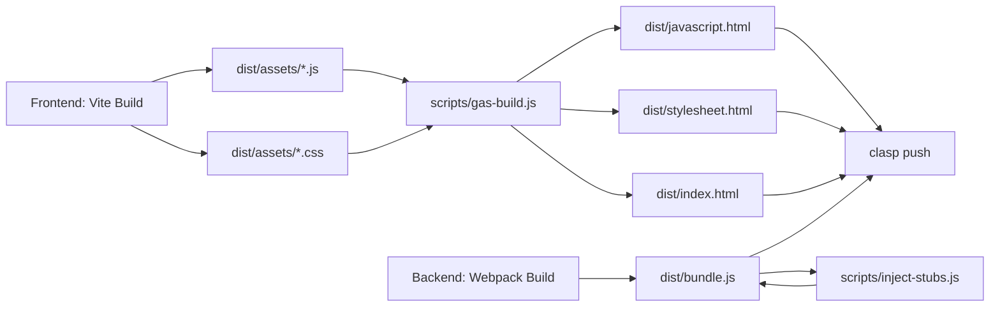
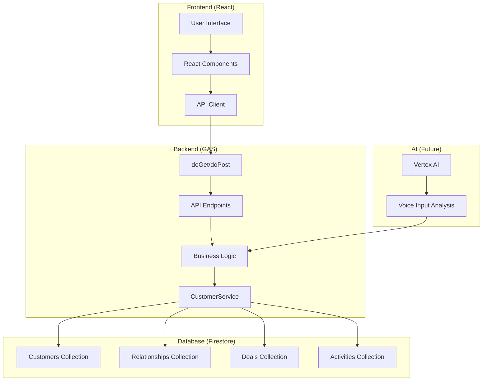
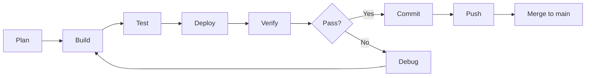

# 🔄 CRM V10 プロジェクト完全引き継ぎ書
**Phase 3以降の開発引き継ぎ用 - VS Code Claude Code (Planner) 向け**

**作成日:** 2025-12-01  
**作成者:** Antigravity AI (Planner Role)  
**対象読者:** VS Code Claude Code (Planner として Phase 3 以降を担当)

---

## 📋 目次
1. [プロジェクト概要](#1-プロジェクト概要)
2. [歴史的経緯 (V5 → V10)](#2-歴史的経緯-v5--v10)
3. [現在の状態 (Phase 2 完了時点)](#3-現在の状態-phase-2-完了時点)
4. [技術アーキテクチャ](#4-技術アーキテクチャ)
5. [認証情報・アカウント情報](#5-認証情報アカウント情報)
6. [GitHub・リポジトリ情報](#6-githubリポジトリ情報)
7. [既知の問題と教訓](#7-既知の問題と教訓)
8. [システム全体像 (Manifest準拠)](#8-システム全体像-manifest準拠)
9. [Phase 3以降の推奨アプローチ](#9-phase-3以降の推奨アプローチ)
10. [重要な開発ルール (鉄の掟)](#10-重要な開発ルール-鉄の掟)

---

## 1. プロジェクト概要

### 1.1 ミッション
**中小企業向け次世代SFA (Sales Force Automation)** の構築。  
Googleエコシステム (GAS + Firestore + Vertex AI) を極限まで活用し、**完全自律稼働 (Zero-Touch)** を実現する。

### 1.2 戦略的目標
- **React (Frontend) と GAS (Backend) の完全分離**
- **Git Worktree による物理隔離開発**
- **AI協業体制 (Squad) による自律運営**
- **RPA検証による品質保証**

### 1.3 現在のフェーズ
- ✅ **Phase 1:** Initialization (完了)
- ✅ **Phase 2:** Backend Architecture Enforcement (完了)
- 🔜 **Phase 3:** Frontend Setup (次のステップ)
- 🔜 **Phase 4:** The Bridge (ビルドパイプライン検証)

---

## 2. 歴史的経緯 (V5 → V10)

### 2.1 バージョン進化の系譜

#### **V5 - V6: AppSheet時代**
- **技術:** AppSheet (ノーコード)
- **課題:** カスタマイズ限界、パフォーマンス問題
- **教訓:** ノーコードツールの限界を認識

#### **V7: GAS + Firestore 移行**
- **技術:** Google Apps Script + Firestore
- **成果:** 10,852件の顧客データ移行成功
- **課題:** フロントエンドの貧弱さ、UI/UX の限界

#### **V8: 試験的React導入**
- **技術:** GAS + React (初期統合)
- **課題:** ビルドシステムの不安定性、デプロイエラー頻発
- **教訓:** React と GAS の統合には専門知識が必要

#### **V9: 安定稼働版 (現行)**
- **技術:** GAS + React + Vite + Webpack
- **成果:**
  - 3-File Pattern (HTML size limitation 回避)
  - `globalThis` による GAS 関数露出
  - `scripts/add-bridge.js` による自動ブリッジ生成
  - 顧客CRUD、検索、ページネーション実装
  - 住所自動入力 (Zipcode Lookup)
- **構成:**
  - `tsconfig.json`: `"module": "None"`
  - `webpack.config.js`: IIFE 出力
  - `src/main.ts`: エントリーポイント
- **デプロイ:** 成功 (Web App として稼働中)

#### **V10: Clean Architecture Re-Platform (現在)**
- **目的:** V9 の教訓を活かし、**完全分離アーキテクチャ** を確立
- **変更点:**
  - `PROJECT_MANIFEST.md` による厳格な開発ルール策定
  - Git Worktree Isolation Protocol の導入
  - エントリーポイントを `src/server.ts` に変更 (Manifest 準拠)
  - AI Squad による自律開発体制
- **現状:** Phase 2 完了、Backend 構成が Manifest に完全準拠

### 2.2 V9 → V10 移行の主な課題

#### **デプロイエラー (500 Error) の連続**
- **症状:** Web App URL アクセス時に「Google ドキュメント内でエラーが発生しました」
- **原因:** `tsconfig.json` の `"module": "ESNext"` 設定が GAS と不適合
- **解決:** `"module": "None"` に変更 (V9 構成への回帰)

#### **GAS 関数認識問題**
- **症状:** `doGet` 関数が GAS ランタイムに認識されない
- **原因:** Webpack のモジュールスコープ問題
- **解決:** `globalThis` への明示的な関数割り当て + `scripts/inject-stubs.js`

#### **HTML サイズ制限**
- **症状:** 1MB 超の単一 HTML ファイルがデプロイ時にクラッシュ
- **原因:** GAS `HtmlService` のサイズ制限 (推定 < 500 KB)
- **解決:** 3-File Pattern (`index.html` + `javascript.html` + `stylesheet.html`)

---

## 3. 現在の状態 (Phase 2 完了時点)

### 3.1 完了した作業

#### **Phase 1: Initialization**
- ✅ Git Worktree `resumption-init` 作成
- ✅ `PROJECT_MANIFEST.md` 読み込み
- ✅ 依存関係インストール (`npm ci`)

#### **Phase 2: Backend Architecture Enforcement**
- ✅ Git Worktree `phase2-backend` 作成
- ✅ `src/main.ts` → `src/server.ts` リネーム
- ✅ `webpack.config.js` エントリーポイント更新
- ✅ ビルド検証成功 (`bundle.js` 15.8 KiB)
- ✅ `CURRENT_STATUS.md` 更新

### 3.2 現在のファイル構成

#### **Backend (GAS) 構成**
```
src/
├── server.ts            # エントリーポイント (doGet/doPost)
├── models/
│   └── Customer.ts      # 顧客データモデル
├── services/
│   ├── CustomerService.ts    # 顧客CRUD操作
│   ├── FirestoreService.ts   # Firestore接続
│   └── AICacheService.ts     # AIキャッシュ (将来)
└── types/
    └── index.ts         # 型定義
```

#### **Frontend (React) 構成**
```
frontend/src/
├── main.tsx             # エントリーポイント
├── App.tsx              # メインアプリケーション
├── App.css
├── index.css
├── components/
│   ├── CustomerForm.tsx      # 顧客作成/編集フォーム
│   └── ErrorBanner.tsx       # エラー表示バナー
├── pages/               # ページコンポーネント (将来)
├── lib/                 # ユーティリティ
└── assets/              # 静的ファイル
```

#### **プロジェクト全体構成**
```
V10/
├── .clasp.json              # GAS プロジェクト設定
├── .env                     # 環境変数 (Firestore認証情報)
├── .gitignore
├── PROJECT_MANIFEST.md      # 開発ルール (絶対的な法)
├── CURRENT_STATUS.md        # 現在の状態記録
├── deployment_handover_report.md  # 過去の失敗記録
├── package.json             # npm スクリプト
├── tsconfig.json            # TypeScript 設定 (module: "None")
├── webpack.config.js        # Webpack 設定 (entry: ./src/server.ts)
├── appsscript.json          # GAS マニフェスト
├── src/                     # Backend (GAS) コード
│   ├── server.ts            # エントリーポイント (旧 main.ts)
│   ├── models/              # データモデル
│   ├── services/            # ビジネスロジック (CustomerService等)
│   └── types/               # 型定義
├── frontend/                # Frontend (React) コード
│   ├── src/
│   ├── vite.config.ts
│   └── package.json
├── scripts/                 # ビルドスクリプト
│   ├── gas-build.js         # 統合ビルドスクリプト
│   └── inject-stubs.js      # GAS 関数ブリッジ生成
├── dist/                    # ビルド出力 (デプロイ対象)
│   ├── bundle.js            # Backend バンドル
│   ├── index.html           # GAS テンプレート
│   ├── javascript.html      # Frontend JS
│   ├── stylesheet.html      # Frontend CSS
│   └── appsscript.json
└── config/
    └── serviceAccount.json  # Firestore サービスアカウント鍵
```

### 3.3 Git Worktree 構成

```
V10/                         # Main Repo (Source of Truth)
└── main ブランチのみ

V10_sandboxes/               # Worktree Container
├── resumption-init/         # Phase 1 作業用
└── phase2-backend/          # Phase 2 作業用 (現在)
```

---

## 4. 技術アーキテクチャ

### 4.1 技術スタック

#### **Backend (GAS)**
- **言語:** TypeScript 5.3.3
- **ランタイム:** Google Apps Script (V8)
- **ビルド:** Webpack 5.103.0
- **設定:**
  - `tsconfig.json`: `"module": "None"`, `"target": "ES2019"`
  - `webpack.config.js`: IIFE 出力 (library type なし)

#### **Frontend (React)**
- **言語:** TypeScript
- **フレームワーク:** React (Vite)
- **ビルド:** Vite
- **UI:** Material UI (Phase 3 で再導入予定)

#### **Database**
- **Firestore (Native Mode)**
- **プロジェクト:** `crm-appsheet-v7`
- **データベース:** `crm-database-v9` (Tokyo)
- **データ:** 10,852 件の顧客データ

#### **AI Integration (将来)**
- **Vertex AI:** 音声入力解析、自動入力支援

### 4.2 ビルドシステム (3-File Pattern)



**処理フロー:**
1. `npm run build:frontend` → Vite が React をビルド
2. `npm run build:backend` → Webpack が GAS コードをビルド
3. `scripts/inject-stubs.js` → `bundle.js` に GAS 関数ブリッジを注入
4. `scripts/gas-build.js` → JS/CSS を HTML ファイルにラップ
5. `clasp push -f` → GAS プロジェクトにデプロイ

### 4.3 データモデル

#### **Customers (顧客)**
```typescript
interface Customer {
  id: string;
  name: string;
  nameKana: string;
  email?: string;
  phone?: string;
  address?: {
    postalCode?: string;
    prefecture?: string;
    city?: string;
    street?: string;
  };
  createdAt: Date;
  updatedAt: Date;
  deletedAt?: Date;  // Soft Delete
}
```

#### **Relationships (関係性)** - 将来実装
#### **Deals (案件)** - 将来実装
#### **Activities (活動履歴)** - 将来実装

---

## 5. 認証情報・アカウント情報

> [!CAUTION]
> **セキュリティ重要事項**
> - `.env` ファイルと `config/serviceAccount.json` は **絶対に Git にコミットしないでください**
> - これらのファイルは `.gitignore` に追加されていることを確認してください
> - 認証情報を共有する場合は、安全な方法 (1Password, Google Secret Manager 等) を使用してください

### 5.1 Firestore 認証情報

> [!IMPORTANT]
> 以下の情報は `.env` ファイルに記載されています。
> **新規開発者向け:** `.env.example` を `.env` にコピーし、実際の値を設定してください。

| プロパティ名 | 設定値 |
| :--- | :--- |
| `FIRESTORE_PROJECT_ID` | `crm-appsheet-v7` |
| `FIRESTORE_DATABASE_ID` | `crm-database-v9` |
| `FIRESTORE_EMAIL` | `crm-v7-automation@crm-appsheet-v7.iam.gserviceaccount.com` |
| `FIRESTORE_KEY` | `config/serviceAccount.json` の `private_key` 全文 |

**サービスアカウント鍵:**
- **ファイル:** `config/serviceAccount.json`
- **権限:** Firestore への読み書き権限
- **取得方法:**
  1. [Google Cloud Console](https://console.cloud.google.com/) にアクセス
  2. プロジェクト `crm-appsheet-v7` を選択
  3. 「IAM と管理」→「サービスアカウント」
  4. `crm-v7-automation@crm-appsheet-v7.iam.gserviceaccount.com` を選択
  5. 「キー」タブ → 「鍵を追加」→「新しい鍵を作成」
  6. JSON 形式でダウンロード
  7. `config/serviceAccount.json` として保存

> [!WARNING]
> サービスアカウント鍵は **絶対に公開しないでください**。漏洩した場合は即座に無効化し、新しい鍵を生成してください。

### 5.2 Google Apps Script プロジェクト

| 項目 | 値 |
| :--- | :--- |
| **Script ID** | `1uitddYvEeSeAI6VL4-akEVgIF6Ms3t7JGAYPfEWHfgXmdYqm9zz-DCNK` |
| **プロジェクト名** | CRM V10 |
| **タイプ** | Standalone Script (Web App) |
| **ランタイム** | V8 |
| **最新デプロイ** | `@13` |

**Web App URL:**
- **最新デプロイ:** `https://script.google.com/macros/s/AKfycbyXKC6V5NCCrUlI_yYaIzumZ9IE8B1CgqUKjA1Ga8.../exec`
- **取得方法:**
  ```powershell
  clasp deployments
  ```
- **ブラウザで確認:** デプロイ後、上記 URL にアクセスして動作確認

> [!NOTE]
> V9 (現行稼働版) の Web App URL は別プロジェクトです。V10 は新規 GAS プロジェクトとして作成されています。

### 5.3 Clasp 認証

**認証状態:** ローカルに `.clasprc.json` が存在 (ユーザーのホームディレクトリ)

**再認証が必要な場合:**
```powershell
clasp login
```

---

## 6. GitHub・リポジトリ情報

### 6.1 リポジトリ詳細

| 項目 | 値 |
| :--- | :--- |
| **リポジトリ名** | `V10` |
| **URL** | `https://github.com/adminsaiproducts/V10` |
| **ブランチ戦略** | `main` (Protected Source of Truth) |
| **ローカルパス** | `C:\Users\satos\OneDrive\○大西\〇新CRMプロジェクト\Githubとの連携リポジトリ宛先\V10` |

### 6.2 Git Worktree Protocol

> [!CAUTION]
> **通常の `git checkout` は禁止です。** 必ず Worktree を使用してください。

**Worktree 作成:**
```powershell
git worktree add ..\V10_sandboxes\<task-name> -b feat/<task-name>
cd ..\V10_sandboxes\<task-name>
npm ci
```

**Worktree 削除:**
```powershell
git worktree remove ..\V10_sandboxes\<task-name>
git branch -d feat/<task-name>
```

### 6.3 コミットルール

**コミットメッセージ形式:**
```
<type>: <subject>

<body>
```

**Type:**
- `feat`: 新機能
- `fix`: バグ修正
- `refactor`: リファクタリング
- `chore`: 雑務 (ビルド設定等)
- `docs`: ドキュメント

**例:**
```
feat: implement customer search functionality

- Add searchCustomers API endpoint
- Add search UI in frontend
- Update CURRENT_STATUS.md
```

---

## 6.4 環境変数テンプレート (.env.example)

**新規開発者向けに `.env.example` を作成してください:**

```bash
# Firestore Configuration
FIRESTORE_PROJECT_ID=crm-appsheet-v7
FIRESTORE_DATABASE_ID=crm-database-v9
FIRESTORE_EMAIL=crm-v7-automation@crm-appsheet-v7.iam.gserviceaccount.com
FIRESTORE_KEY=<config/serviceAccount.json の private_key をここに貼り付け>
```

**セットアップ手順:**
1. `.env.example` を `.env` にコピー
2. `FIRESTORE_KEY` に実際のサービスアカウント鍵を設定
3. `.env` が `.gitignore` に含まれていることを確認

---

## 7. 既知の問題と教訓

### 7.1 Critical Issues (過去の失敗)

#### **Issue 1: TypeScript Module 設定ミス**
- **症状:** 500 Error (GAS デプロイ後)
- **原因:** `tsconfig.json` の `"module": "ESNext"` が GAS と不適合
- **解決:** `"module": "None"` に変更
- **教訓:** GAS は CommonJS または None のみサポート

#### **Issue 2: Webpack Library Type 設定**
- **症状:** `doGet` 関数が認識されない
- **原因:** `output.library.type` 設定により関数がモジュールスコープに閉じ込められる
- **解決:** `library` 設定を削除し、IIFE として出力
- **教訓:** GAS はグローバルスコープの関数のみ認識

#### **Issue 3: HTML サイズ制限**
- **症状:** デプロイ時にクラッシュ (1MB 超の HTML)
- **原因:** GAS `HtmlService` のサイズ制限 (推定 < 500 KB)
- **解決:** 3-File Pattern (JS/CSS を別ファイルに分離)
- **教訓:** GAS には隠れた制限が多数存在

#### **Issue 4: `clasp push` の \"already up to date\" 問題**
- **症状:** `clasp push` が変更を検出しない
- **原因:** 不明 (clasp のバグの可能性)
- **解決:** `clasp push -f` (強制プッシュ) を使用
- **教訓:** `-f` フラグを常用する

### 7.2 Lessons Learned (教訓)

1. **V9 構成を尊重せよ**
   - V9 は実戦で検証済み。新規実装時は V9 の設定を踏襲する。

2. **GAS の制約を理解せよ**
   - モジュールシステム: None または CommonJS のみ
   - HTML サイズ: < 500 KB
   - 関数スコープ: グローバルのみ

3. **ビルドパイプラインを信頼せよ**
   - `scripts/gas-build.js` と `scripts/inject-stubs.js` は V9 で実証済み
   - 変更する場合は慎重に

4. **RPA 検証を怠るな**
   - 「動いているはず」は禁止
   - デプロイ後は必ずブラウザで動作確認

5. **ドキュメントを更新せよ**
   - `CURRENT_STATUS.md` の Changelog は必須
   - コミット前に必ず更新

---

## 7.3 トラブルシューティングガイド

### よくあるエラーと解決方法

#### **Q1: `clasp push` が "already up to date" と表示される**
**A:** `clasp push -f` (強制プッシュ) を使用してください。
```powershell
clasp push -f
```

#### **Q2: デプロイ後に 500 Error が発生する**
**A:** 以下を確認してください:
1. `tsconfig.json` の `module` が `"None"` になっているか
2. `webpack.config.js` に `library` 設定がないか
3. `dist/bundle.js` に `globalThis` 割り当てが含まれているか
4. GAS エディタでログを確認: `clasp logs`

#### **Q3: Firestore 接続エラーが発生する**
**A:** 以下を確認してください:
1. `.env` ファイルが存在し、正しい値が設定されているか
2. `config/serviceAccount.json` が存在するか
3. サービスアカウントに Firestore の権限があるか

#### **Q4: Frontend のビルドエラーが発生する**
**A:** 依存関係を再インストールしてください:
```powershell
cd frontend
rm -r node_modules
npm install
npm run build
```

#### **Q5: GAS のログを確認したい**
**A:** 以下のコマンドでログを確認できます:
```powershell
clasp logs
```
または、GAS エディタ → 「実行数」→ 「ログを表示」

---

## 8. システム全体像 (Manifest準拠)

### 8.1 システムアーキテクチャ



### 8.2 主要機能 (現在実装済み)

#### **顧客管理 (Customers)**
- ✅ 一覧表示 (ページネーション対応)
- ✅ 検索機能 (名前、カナ、メール、電話)
- ✅ 詳細表示
- ✅ 新規作成
- ✅ 更新
- ✅ 住所自動入力 (郵便番号検索)
- ⏳ 削除 (Soft Delete) - 未実装

#### **将来実装予定**
- ⏳ 関係性管理 (Relationships)
- ⏳ 案件管理 (Deals)
- ⏳ 活動履歴 (Activities)
- ⏳ ダッシュボード (経営コックピット)
- ⏳ 音声入力 (Vertex AI)

### 8.3 API エンドポイント

| エンドポイント | メソッド | 説明 |
| :--- | :--- | :--- |
| `api_getCustomers` | GET | 顧客一覧取得 (ページネーション) |
| `api_searchCustomers` | GET | 顧客検索 |
| `api_getCustomerById` | GET | 顧客詳細取得 |
| `api_createCustomer` | POST | 顧客作成 |
| `api_updateCustomer` | POST | 顧客更新 |
| `api_deleteCustomer` | POST | 顧客削除 (未実装) |

**呼び出し方法 (Frontend):**
```typescript
google.script.run
  .withSuccessHandler(callback)
  .withFailureHandler(errorCallback)
  .api_getCustomers(page, limit);
```

---

## 9. Phase 3以降の推奨アプローチ

### 9.1 Phase 3: Frontend Setup

#### **目標**
- React フロントエンドの構成確認
- Material UI の再導入
- React Router の再導入

#### **推奨手順**
1. **新規 Worktree 作成:**
   ```powershell
   git worktree add ..\V10_sandboxes\phase3-frontend -b feat/phase3-frontend
   cd ..\V10_sandboxes\phase3-frontend
   npm ci
   ```

2. **Frontend 依存関係確認:**
   ```powershell
   cd frontend
   npm install
   ```

3. **Material UI 再導入:**
   ```powershell
   npm install @mui/material @emotion/react @emotion/styled
   ```

4. **React Router 再導入:**
   ```powershell
   npm install react-router-dom
   ```

5. **ビルド検証:**
   ```powershell
   npm run build:frontend
   ```

6. **統合ビルド:**
   ```powershell
   cd ..
   npm run build
   ```

7. **デプロイ & 検証:**
   ```powershell
   clasp push -f
   clasp deploy --description "Phase 3: Frontend Setup"
   ```

### 9.2 Phase 4: The Bridge

#### **目標**
- ビルドパイプラインの検証
- `scripts/gas-build.js` の動作確認
- `scripts/inject-stubs.js` の動作確認

#### **推奨手順**
1. **スクリプトのドライラン:**
   ```powershell
   node scripts/gas-build.js
   ```

2. **出力ファイルの検証:**
   - `dist/bundle.js` に `globalThis` 割り当てが含まれているか
   - `dist/javascript.html` が `<script>` タグでラップされているか
   - `dist/stylesheet.html` が `<style>` タグでラップされているか

3. **RPA 検証:**
   - Playwright によるブラウザ自動テスト
   - 顧客一覧、検索、詳細、作成、更新の動作確認

### 9.3 開発サイクル



---

## 10. 重要な開発ルール (鉄の掟)

### 10.1 Git Worktree Isolation Protocol

> [!CAUTION]
> **絶対に `git checkout` を使用しないでください。**

- ✅ **DO:** `git worktree add ..\V10_sandboxes\<task> -b feat/<task>`
- ❌ **DON'T:** `git checkout -b feat/<task>`

### 10.2 Technical Rules

1. **React と GAS の完全分離**
   - `src/` (Backend) と `frontend/` (Frontend) の相互 import 禁止

2. **PowerShell でのファイル生成禁止**
   - コード生成は Node.js スクリプトで行う
   - PowerShell は実行のみ

3. **TypeScript 設定の厳守**
   - `tsconfig.json`: `"module": "None"`
   - `webpack.config.js`: `library` 設定なし (IIFE)

4. **3-File Pattern の維持**
   - `index.html` + `javascript.html` + `stylesheet.html`
   - 単一 HTML ファイルは禁止

5. **globalThis 露出の必須化**
   - GAS 関数は必ず `globalThis` に割り当て
   - `scripts/inject-stubs.js` で自動化

### 10.3 Autonomous Execution Protocol

> [!NOTE]
> AI は以下のコマンドを **ユーザー確認なしで実行** してください。

- `npm install`, `npm ci`
- `npm run build`, `npm run build:backend`, `npm run build:frontend`
- `git add`, `git commit`, `git push`
- `git worktree add`, `git worktree remove`
- `clasp push`, `clasp deploy`

**例外:** 破壊的操作 (`rm -rf`, データ削除等) のみ確認を求める。

### 10.4 Documentation Protocol

**コミット前に必ず実施:**
1. `CURRENT_STATUS.md` の Changelog 更新
2. 変更内容を簡潔に記載
3. Status を `✅ Done` に更新

**例:**
```markdown
| 2025-12-01 | FEAT | Material UI 再導入 | ✅ Done |
```

### 10.5 Anti-Hallucination Protocol

> [!WARNING]
> **「動いているはず」は禁止です。**

- デプロイ後は **必ず** ブラウザで動作確認
- RPA 検証 (Playwright) を実施
- スクリーンショットを証拠として保存

---

## 📚 参考資料

### 必読ドキュメント
1. **PROJECT_MANIFEST.md** - 開発ルールの絶対的な法
2. **CURRENT_STATUS.md** - 現在の状態記録
3. **deployment_handover_report.md** - 過去の失敗記録

### 重要ファイル
- `tsconfig.json` - TypeScript 設定
- `webpack.config.js` - Webpack 設定
- `scripts/gas-build.js` - 統合ビルドスクリプト
- `scripts/inject-stubs.js` - GAS 関数ブリッジ生成
- `.clasp.json` - GAS プロジェクト設定
- `.env` - 環境変数 (認証情報)

### コマンドリファレンス

```powershell
# ビルド
npm run build:backend    # Backend のみ
npm run build:frontend   # Frontend のみ
npm run build            # 統合ビルド

# デプロイ
clasp push -f            # GAS にプッシュ (強制)
clasp deploy --description "Phase X: Description"

# Worktree
git worktree add ..\V10_sandboxes\<task> -b feat/<task>
git worktree list
git worktree remove ..\V10_sandboxes\<task>

# Git
git status
git add .
git commit -m "feat: description"
git push origin feat/<task>
```

---

## 🎯 次のアクション

**Phase 3: Frontend Setup を開始してください。**

1. 新規 Worktree `phase3-frontend` を作成
2. Material UI と React Router を再導入
3. Frontend ビルドを検証
4. 統合ビルドを実行
5. デプロイして動作確認
6. `CURRENT_STATUS.md` を更新
7. コミット & プッシュ

**成功の定義:**
- ✅ Frontend が Material UI でスタイリングされている
- ✅ React Router でページ遷移が機能している
- ✅ ビルドエラーがない
- ✅ デプロイ後にブラウザで正常に表示される

---

**Good luck! 🚀**

---

**作成者ノート:**
この引き継ぎ書は、V5 から V10 までの全ての経験と教訓を集約したものです。
特に V9 での成功パターンと V10 での失敗パターンを詳細に記録しました。
Phase 3 以降の開発では、この引き継ぎ書を「憲法」として扱い、厳格に従ってください。

不明点があれば、`PROJECT_MANIFEST.md` と `CURRENT_STATUS.md` を参照してください。
