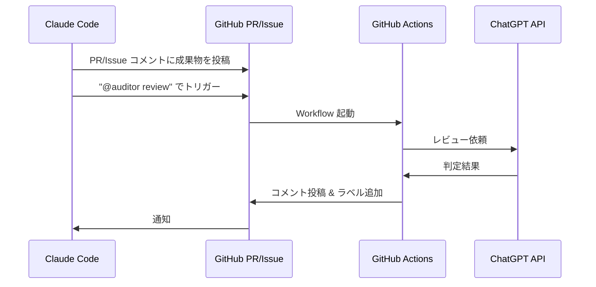

# 🤖 Auditor 自動化セットアップガイド
**GitHub Actions + ChatGPT API による完全自動レビュー**

---

## 📋 概要

このガイドでは、GitHub Actions と ChatGPT API を使用して、Auditor レビューを完全自動化する方法を説明します。

### 自動化されるワークフロー



---

## 🔧 セットアップ手順

### Step 1: OpenAI API キーの取得

1. **OpenAI アカウントにログイン**
   - https://platform.openai.com/

2. **API キーを作成**
   - Settings → API keys → Create new secret key
   - キーをコピー（後で使用）

3. **使用量制限を設定（推奨）**
   - Settings → Billing → Usage limits
   - 月額上限を設定（例: $10）

### Step 2: GitHub Secrets の設定

1. **GitHub リポジトリにアクセス**
   - https://github.com/[YOUR_USERNAME]/V10

2. **Secrets を追加**
   - Settings → Secrets and variables → Actions
   - "New repository secret" をクリック
   - Name: `OPENAI_API_KEY`
   - Secret: [Step 1 で取得した API キー]
   - "Add secret" をクリック

### Step 3: GitHub Actions Workflow の確認

**ファイル:** `.github/workflows/auditor-review.yml`

このファイルは既に作成されています。以下を確認してください:

- ✅ ファイルが存在する
- ✅ `OPENAI_API_KEY` が Secrets に設定されている
- ✅ リポジトリの Actions が有効になっている

### Step 4: テスト実行

1. **テスト用 PR を作成**
   ```bash
   git checkout -b test/auditor-automation
   echo "# Test" >> TEST.md
   git add TEST.md
   git commit -m "test: auditor automation"
   git push origin test/auditor-automation
   ```

2. **PR を作成**
   - GitHub で PR を作成

3. **レビュー依頼コメントを投稿**
   ```markdown
   **タスク名:** Auditor 自動化テスト
   
   **実施内容:**
   - GitHub Actions Workflow を作成
   - ChatGPT API 連携を実装
   
   **変更ファイル:**
   - .github/workflows/auditor-review.yml
   
   **テスト結果:**
   - ビルド: ✅ 成功
   
   @auditor review
   ```

4. **結果を確認**
   - GitHub Actions タブで Workflow の実行を確認
   - PR コメントに Auditor の判定結果が投稿される

---

## 📖 使用方法

### Claude Code からの使用

**Phase 3 完了後の報告例:**

```markdown
# Phase 3: Frontend Setup 完了報告

**タスク名:** Phase 3: Frontend Setup

**実施内容:**
- Material UI インストール完了
- React Router インストール完了
- ビルド成功 (エラーなし)
- デプロイ成功

**変更ファイル:**
- frontend/package.json
- frontend/src/App.tsx
- CURRENT_STATUS.md

**テスト結果:**
- Frontend ビルド: ✅ 成功
- 統合ビルド: ✅ 成功
- デプロイ: ✅ 成功
- 動作確認: ✅ 正常表示

@auditor review
```

**重要:** 最後に `@auditor review` を必ず含めてください。これが Workflow のトリガーです。

### Auditor の判定結果

**Approve の場合:**
```markdown
## ✅ Auditor Review Result

**判定:** ✅ Approve

**評価:**
- ルール準拠: ✅
- 品質: ✅
- ドキュメント: ✅
- 動作確認: ✅

**理由:**
- Material UI と React Router が正しくインストールされている
- ビルドエラーがない
- CURRENT_STATUS.md が更新されている
- デプロイが成功している

**次のアクション:**
Git Commit & Push を実行してください。

---
*Automated review by ChatGPT Auditor*
```

**Reject の場合:**
```markdown
## ❌ Auditor Review Result

**判定:** ❌ Reject

**評価:**
- ルール準拠: ✅
- 品質: ❌
- ドキュメント: ❌
- 動作確認: ✅

**理由:**
- TypeScript の型エラーが残っている
- CURRENT_STATUS.md の Changelog が更新されていない

**改善提案:**
- `npm run type-check` を実行して型エラーを修正
- CURRENT_STATUS.md の Changelog セクションに変更内容を追記

**次のアクション:**
修正後に再提出してください。

---
*Automated review by ChatGPT Auditor*
```

---

## 🔍 トラブルシューティング

### Workflow が起動しない

**原因:**
- `@auditor review` が含まれていない
- GitHub Actions が無効になっている

**解決策:**
1. コメントに `@auditor review` を含める
2. Settings → Actions → General → "Allow all actions" を選択

### ChatGPT API エラー

**原因:**
- API キーが無効
- 使用量制限に達した
- API キーの権限不足

**解決策:**
1. OpenAI ダッシュボードで API キーを確認
2. 使用量を確認（Settings → Usage）
3. 新しい API キーを作成して Secrets を更新

### レビュー結果が不正確

**原因:**
- プロンプトが不十分
- ChatGPT が PROJECT_MANIFEST.md を参照できていない

**解決策:**
1. Workflow の system プロンプトを改善
2. レビュー依頼に詳細情報を含める
3. GPT-4 モデルを使用（gpt-3.5-turbo より精度が高い）

---

## 💰 コスト試算

### ChatGPT API 料金（GPT-4）

- **Input:** $0.03 / 1K tokens
- **Output:** $0.06 / 1K tokens

### 1回のレビューあたりのコスト

- **Input tokens:** 約 1,500 tokens（レビュー依頼 + システムプロンプト）
- **Output tokens:** 約 500 tokens（判定結果）
- **合計:** 約 $0.075（約 11円）

### 月間コスト試算

- **1日 5回のレビュー:** $0.375/日
- **月間（20営業日）:** $7.5/月（約 1,100円）

**推奨:** 月額上限を $10-20 に設定

---

## 🎯 次のステップ

1. **セットアップ完了チェック**
   - [ ] OpenAI API キーを取得
   - [ ] GitHub Secrets に API キーを設定
   - [ ] Workflow ファイルを確認
   - [ ] テスト実行を完了

2. **Claude Code への指示更新**
   - `INITIAL_PROMPT_FOR_CLAUDE_CODE.txt` を更新
   - PR/Issue コメントでレビュー依頼する方法を追記

3. **運用開始**
   - Phase 3 から自動レビューを使用
   - フィードバックを収集してプロンプトを改善

---

## 📚 参考資料

- [OpenAI API Documentation](https://platform.openai.com/docs/api-reference)
- [GitHub Actions Documentation](https://docs.github.com/en/actions)
- [GitHub API - Reviews](https://docs.github.com/en/rest/pulls/reviews)

---

**作成者:** Antigravity AI  
**作成日:** 2025-12-02  
**対象:** CRM V10 プロジェクト開発チーム
